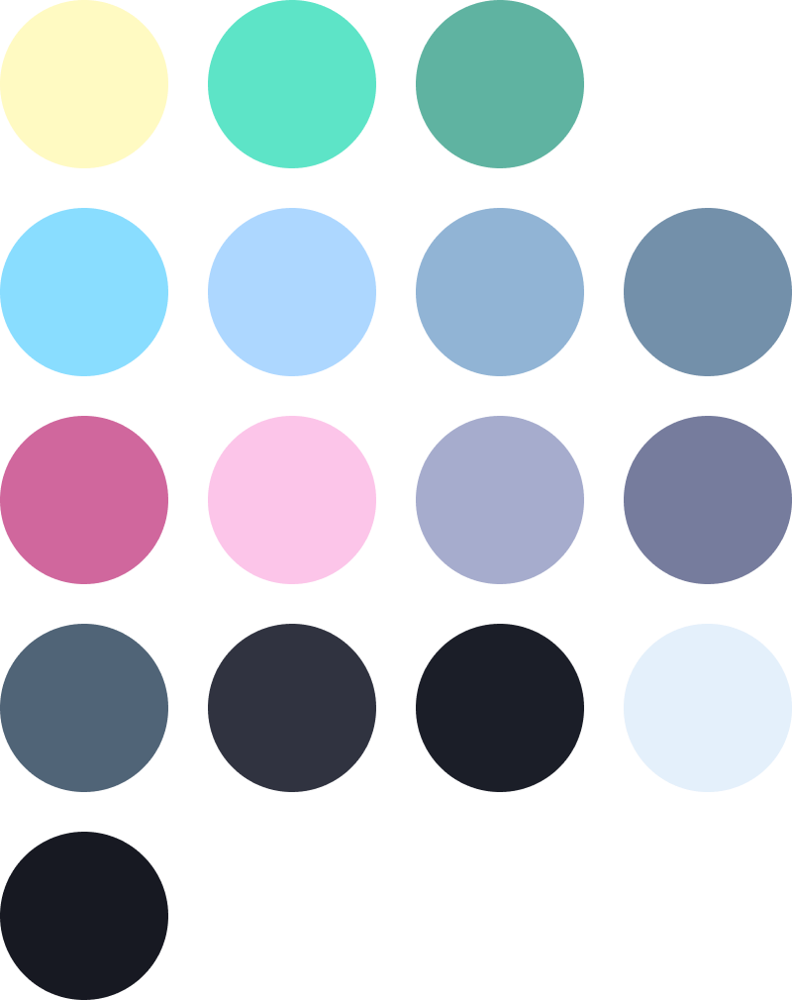
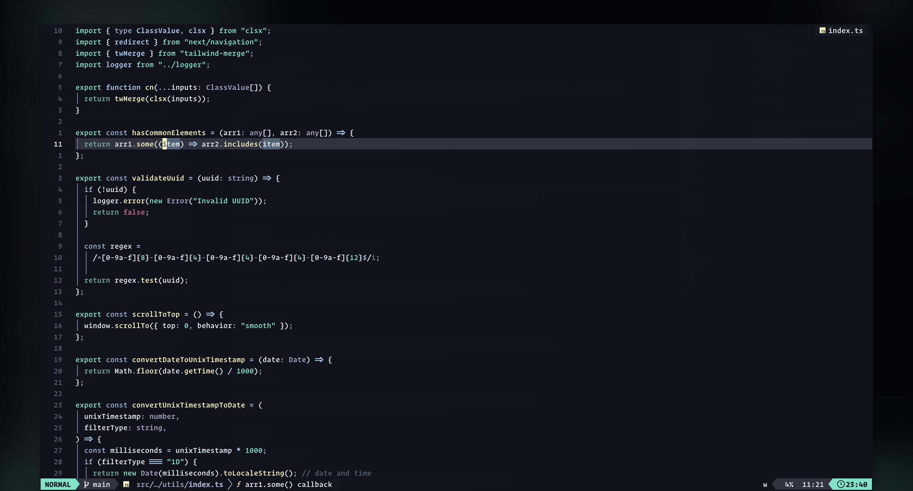

<div align="center">       <h1>poimandresish.nvim</h1>
</div>

<p align="center">
  <a href="#">
    
  </a>
</p>

neovim theme based on the [poimandres vscode theme](https://github.com/drcmda/poimandres-theme), written in Lua with treesitter support.



### Plugin Support

- [TreeSitter](https://github.com/nvim-treesitter/nvim-treesitter)
- [LSP Diagnostics](https://neovim.io/doc/user/lsp.html)
- [LSP Trouble](https://github.com/folke/lsp-trouble.nvim)
- [Git Signs](https://github.com/lewis6991/gitsigns.nvim)
- [Telescope](https://github.com/nvim-telescope/telescope.nvim)
- [NvimTree](https://github.com/kyazdani42/nvim-tree.lua)
- [Lualine](https://github.com/hoob3rt/lualine.nvim)
- [Indent Blankline](https://github.com/lukas-reineke/indent-blankline.nvim)
- [Hop](https://github.com/phaazon/hop.nvim)
- [Leap](https://github.com/ggandor/leap.nvim)

_More plugins will be supported as I personally need it, or when it is requested._

## 📦 Installation

_**IMPORTANT!** The `setup` function has to be invoked before the colorscheme is set!_

Install with [lazy.nvim](https://github.com/folke/lazy.nvim):

```lua
-- Lua

{
  'webhooked/poimandresish.nvim',
  lazy = false,
  priority = 1000,
  config = function()
    require('poimandresish').setup {
      -- leave this setup function empty for default config
      -- or refer to the configuration section
      -- for configuration options
    }
  end,

  -- optionally set the colorscheme within lazy config
  init = function()
    vim.cmd("colorscheme poimandresish")
  end
}
```

<details>
<summary>Install with packer:</summary>

[packer.nvim](https://github.com/wbthomason/packer.nvim)

```lua
-- Lua

use {
  'webhooked/poimandresish.nvim',
  config = function()
    require('poimandresish').setup {
      -- leave this setup function empty for default config
      -- or refer to the configuration section
      -- for configuration options
    }
  end
}
```

</details>

<details>
<summary>Install with vim-plug:</summary>
  
[vim-plug](https://github.com/junegunn/vim-plug)
  
```vim
" Vim Script

Plug 'webhooked/poimandresish.nvim'

lua << EOF
require('poimandresish').setup {
" leave this setup function empty for default config
" or refer to the configuration section
" for configuration options
}
EOF

````

</details>


## 🚀 Usage

**Enable the colorscheme**:

_**IMPORTANT!** The `setup` function has to be invoked before the colorscheme is set!_

```lua
-- Lua

vim.cmd('colorscheme poimandresish')
````

```vim
" Vim Script

colorscheme poimandresish
```

## ⚙️ Configuration:

**Setup function options**:

```lua
require('poimandresish').setup {
  bold_vert_split = false, -- use bold vertical separators
  dim_nc_background = false, -- dim 'non-current' window backgrounds
  disable_background = false, -- disable background
  disable_float_background = false, -- disable background for floats
  disable_italics = false, -- disable italics
  transparent = false, -- enable transparent background (overrides disable_background)
  background = { -- background color variants
    light = "storm", -- used when vim.o.background = "light"
    dark = "night",  -- used when vim.o.background = "dark"
  },
  -- Available background options: "noir" (#13151D), "night" (#1B1E28), "storm" (#252B37)
  -- You can also use the simplified options:
  -- bold = false,    -- shorthand for bold_vert_split
  -- italics = true,  -- shorthand for disable_italics (inverted)
}
```

**Example configurations**:

```lua
-- Transparent background with no italics
require('poimandresish').setup {
  transparent = true,
  italics = false,
}

-- Dark theme with noir background
require('poimandresish').setup {
  background = {
    light = "storm",
    dark = "noir",
  },
  bold = false,
  italics = false,
}
```

To enable Poimandresish for `Lualine`, just set the theme in your Lualine configuration:

```lua
require('lualine').setup {
  options = {
    -- ... your lualine config
    theme = 'poimandresish'
    -- ... your lualine config
  }
}
```

## Contributions

Feel free to help improving the color scheme by opening issues and PRs with features, fixes or changes.
